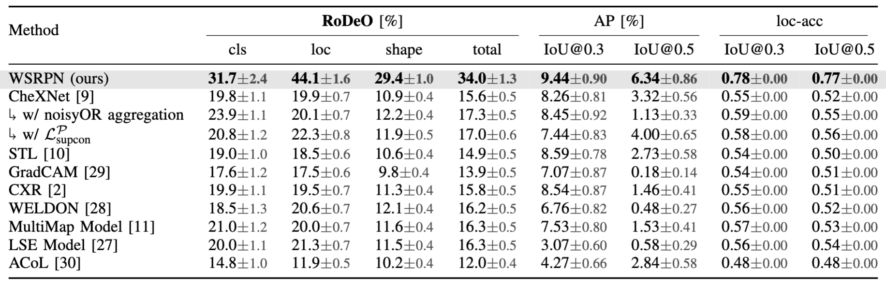

# Weakly Supervised Object Detection in Chest X-Rays with Differentiable ROI Proposal Networks and Soft ROI Pooling
This is the official PyTorch implementation of WSRPN.

**[[Paper - arXiv:2402.11985]](https://arxiv.org/abs/2402.11985) | IEEE Transactions on Medical Imaging (TMI) [[DOI: 10.1109/TMI.2024.3435015]](https://doi.org/10.1109/TMI.2024.3435015)**

> **Weakly Supervised Object Detection in Chest X-Rays with Differentiable ROI Proposal Networks and Soft ROI Pooling** <br>
> Philip Müller*, Felix Meissen*, Georgios Kaissis, Daniel Rueckert <br>

<p align="center">

</p>

> **Abstract:** Weakly supervised object detection (WSup-OD) increases
the usefulness and interpretability of image classification
algorithms without requiring additional supervision.
The successes of multiple instance learning in this task for
natural images, however, do not translate well to medical
images due to the very different characteristics of their objects
(i.e. pathologies). In this work, we propose Weakly Supervised
ROI Proposal Networks (WSRPN), a new method
for generating bounding box proposals on the fly using a
specialized ROI-attention module. WSRPN integrates well
with classic backbone-head classification algorithms and
is end-to-end trainable with only image-label supervision.
We experimentally demonstrate that our new method outperforms
existing methods in the very challenging task of
disease localization in chest X-ray images.

## Outline

1. [Setup](#setup)
2. [Training and Evaluating our Model WSRPN](#training-and-evaluating-our-model-wsrpn)
3. [Training and Evaluating Baselines](#training-and-evaluating-baselines)
4. [Results](#results)
5. [Citation](#citation)

## Setup
Setup the conda/python environment by calling the following commands from the root dir of this project:
    

    conda env create -f environment.yml 
    pip install -e .


Prepare the dataset folder by either creating the folder `/datasets/CXR8` or by specifying the path in the environment variable `CXR8_DIR`. Note that it is enough to create an empty folder, the data will de downloaded automatically.


Optional: Setup W&B by setting the environment variables `WANDB_PROJECT` (specify the project name here, by default it's set to "WSRPN") and `WANDB_ENTITY` (by default it's logging directly to your wandb userspace) such that training is logged to the correct project.


## Training and Evaluating our Model WSRPN
To train our model WSRPN with default hyperparameters call

    python src/train.py

If you want to adapt hyperparameters of our model, these can be changed in the file `src/conf/model/wsrpn.yaml` or they can be overwritten using Hydra-style command line arguments. Training details (such as learning rate, etc.) can be specified in the file `src/conf/experiment.wsrpn.yaml`.

By default the model is tested after training has finished.
To manually evaluate the model the following command can be used:

    python src/evaluate.py model_name=wsrpn

## Training and Evaluating Baselines
Baseline models can be trained by specifying the baseline name, i.e.:

    python src/train.py experiment=<baseline_name>

where <baseline_name> can be one of the baselines:
- chexnet
- stl_model
- gradcam_model
- cxr_model
- weldon
- multi_map_model
- lse_model
- acol
- wsddn

See the folders `src/conf/model` and `src/conf/experiment` for details. 

For the WSDDN baseline with Edge Boxes, the OpenCV model must first be downloaded from [here](https://github.com/opencv/opencv_extra/blob/master/testdata/cv/ximgproc/model.yml.gz) and put into `.resources/edge_box_model.yml.gz`.

## Results



## Qualitative Results


## Citation
```
@article{mueller2023wsrpn,
  author={Müller, Philip and Meissen, Felix and Kaissis, Georgios and Rueckert, Daniel},
  journal={IEEE Transactions on Medical Imaging}, 
  title={Weakly Supervised Object Detection in Chest X-Rays with Differentiable ROI Proposal Networks and Soft ROI Pooling}, 
  year={2024},
  volume={},
  number={},
  pages={},
  doi={10.1109/TMI.2024.3435015}
}
```
